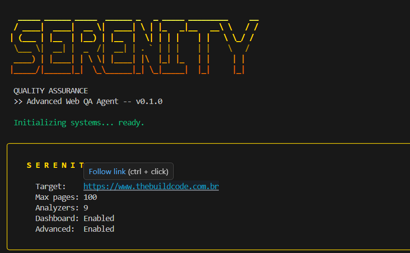

<p align="center">
  
</p>

<h1 align="center">SERENITY QA</h1>

<p align="center">
  <strong>O agente de QA que seu software precisa, mas nunca teve.</strong>
</p>

<p align="center">
  
  
  
  
</p>

---

## A verdade que ninguem te conta

Voce deploya. O site parece bonito. O cliente aprova. Tudo certo.

Ate o dia que o Google derruba seu ranking porque faltam meta tags. Ate o dia que um usuario cego processa porque os formularios nao tem labels. Ate o dia que o mobile mostra uma barra de scroll horizontal que ninguem testou. Ate o dia que um pentest basico revela seus tokens expostos no localStorage.

**O problema nao e o que voce ve. E o que voce nao ve.**

O Serenity ve. Ele acessa cada pagina como um usuario real, clica em cada botao, preenche cada formulario, testa cada breakpoint, mede cada milissegundo, calcula cada ratio de contraste, injeta falhas, simula queda de rede, detecta memory leaks e monta um relatorio completo com score, prioridade de correcao e prompt pronto para seu agente de IA corrigir tudo.

Um comando. Um relatorio. Zero desculpas.

---

<p align="center">
  
</p>

---

## Inicio Rapido

```bash
# 1. Clone o repositorio
git clone https://github.com/seu-usuario/Serenity-QA.git
cd Serenity-QA

# 2. Crie o ambiente virtual e instale
python -m venv .venv
.venv\Scripts\activate        # Windows
# source .venv/bin/activate   # Linux/Mac

pip install -e .
playwright install chromium

# 3. Execute
python Serenity.py --url https://seusite.com --live
```

---

## Como Usar

### Scan completo com dashboard em tempo real
```bash
python Serenity.py --url https://seusite.com --live
```

### Output organizado em pasta nomeada
```bash
python Serenity.py --url https://seusite.com -o meusite --live
```
Cria `./meusite/` com:
- `serenity-report.html` — relatorio interativo navegavel
- `serenity-report.json` — dados estruturados para CI/CD
- `serenity-report.pdf` — relatorio formatado para cliente
- `prompt_recall.md` — prompt de engenharia avancada para agente de IA

### Scan rapido
```bash
python Serenity.py --url https://seusite.com --no-advanced --no-ai --max-pages 20
```

### Apenas dominios especificos
```bash
python Serenity.py --url https://seusite.com --domains seo performance accessibility
```

---

## Flags CLI

| Flag | Descricao | Default |
|------|-----------|---------|
| `--url URL` | URL alvo **(obrigatorio)** | — |
| `--live` | Dashboard em tempo real no browser | off |
| `-o NOME` | Pasta de output nomeada | — |
| `--output-dir DIR` | Diretorio de output | `./serenity-report` |
| `--max-pages N` | Maximo de paginas a crawlear | 100 |
| `--timeout N` | Timeout por pagina em segundos | 30 |
| `--domains D1 D2` | Dominios especificos | todos |
| `--format FMT` | html, pdf, json, all | all |
| `--no-advanced` | Pula modulos avancados (Phase 4) | off |
| `--no-ai` | Pula analise com IA (Phase 5) | off |
| `--headed` | Browser visivel durante o scan | off |
| `-v / -vv` | Nivel de verbosidade | warning |

---

## O Que o Serenity Analisa

### 9 Dominios de Analise

| # | Dominio | O que verifica |
|---|---------|---------------|
| 1 | **Infraestrutura** | SSL, HTTPS, headers de seguranca (CSP, HSTS, X-Frame-Options), TTFB, arquivos sensiveis expostos |
| 2 | **Performance** | LCP, CLS, INP, tempo de carregamento, tamanho da pagina, render-blocking, lazy load, fontes |
| 3 | **SEO** | Title, meta description, H1, headings, Open Graph, sitemap, robots.txt, canonical, Schema.org |
| 4 | **Funcionalidade** | Links quebrados (404), JS errors no console, redirect loops, cookies inseguros, dados em localStorage |
| 5 | **Responsividade** | Screenshots em 375/768/1280px, overflow horizontal, touch targets 44x44, zoom, CLS por imagens |
| 6 | **Acessibilidade** | Contraste WCAG 2.1, alt text, labels, lang, skip nav, focus order, ARIA landmarks |
| 7 | **Agente Clicador** | Clica em cada elemento interativo, mapeia grafo de navegacao, detecta dead-ends e fake clickables |
| 8 | **Conteudo** | Placeholders (Lorem ipsum, TODO), datas desatualizadas, tokens no JS, links sociais quebrados |
| 9 | **Formularios** | Envio vazio, dados invalidos, XSS/SQLi basico, mensagens de erro, validacao client/server |

### Modulos Avancados (Phase 4)

| Modulo | O que faz |
|--------|-----------|
| **Chaos Engineering** | Injeta falhas controladas (500, timeout, JSON corrompido, offline) e observa como a UI reage |
| **Memory Leak Detector** | Monitora heap JS via Chrome DevTools Protocol em ciclos de navegacao |
| **Race Condition Detector** | Dispara interacoes em paralelo com timing conflitante |
| **Network Analysis** | Intercepta 100% do trafego HTTP, mapeia APIs, detecta dados sensiveis em transito |
| **Cache Audit** | Compara carregamento frio vs quente, analisa estrategia de cache por bytes transferidos |
| **Behavioral Analysis** | Simula comportamento humano real (mouse Bezier, timing Poisson) |
| **i18n Stress Test** | Pseudolocalizacao, strings longas para quebrar layouts |
| **WebSocket/SSE** | Monitora conexoes em tempo real, testa queda de conexao |

### Analise com IA (Phase 5)

Requer `GEMINI_API_KEY` no `.env`.

| Modulo | O que faz |
|--------|-----------|
| **UX Judge** | Envia screenshots para LLM avaliar hierarquia visual, CTA e copy |
| **Gerador de Testes** | Gera arquivo de testes Playwright/pytest automaticamente |
| **Motor de Sugestoes** | Sugestoes de melhoria priorizadas por impacto no score |

---

## Sistema de Score

Score de **0 a 100** com pesos por dominio:

| Dominio | Peso |
|---------|------|
| Performance | 25% |
| SEO | 20% |
| Funcionalidade + Clicador | 20% |
| Responsividade | 20% |
| Acessibilidade | 5% |
| Infraestrutura | 10% |

| Score | Veredicto |
|-------|-----------|
| 0-69 | **REPROVADO** |
| 70-90 | **APROVADO** |
| 91-100 | **EXCELENTE** |

### Calibragem inteligente (37 padroes)

O Serenity foi calibrado em 13 iteracoes para minimizar falsos positivos:

- Detecta auth gates e pula paginas que redirecionam para login
- Agrupa issues identicos por pagina com penalidade decrescente
- Calcula contraste com compositing RGBA e skip de video backgrounds
- Mede touch targets incluindo padding do elemento pai
- Skip overflow quando `overflow-x: hidden/auto/scroll` e intencional
- Skip assets com content-hash no filename (cache valido)
- Testa chaos engineering apenas em API calls same-domain
- Fallback triplo para deteccao de `lang` (DOM, querySelector, HTTP)
- Ignora landmarks completos em paginas de login standalone
- CSP rebaixado quando os outros 5 headers de seguranca existem

---

## Dashboard --live

O dashboard abre automaticamente em `http://127.0.0.1:8765` com:

- Velocimetro de score geral (0-100)
- Progresso do scan com ETA
- Findings por severidade (critico, alto, medio, baixo)
- Scores por dominio com barras de progresso
- Heatmap de paginas (passou/analisando/falhou)
- Log de findings em tempo real com filtros

Design inspirado na Grecia antiga: marmore, ouro e azul do mar.

---

## Relatorios

| Formato | Descricao |
|---------|-----------|
| **HTML** | Relatorio interativo navegavel, filtravel por dominio e severidade |
| **PDF** | Formatado para enviar ao cliente (requer GTK no Windows) |
| **JSON** | Dados estruturados para integracao com CI/CD |
| **prompt_recall.md** | Prompt em PT-BR para agente de IA corrigir todos os problemas |

O `prompt_recall.md` contem: contexto do scan, score por dominio, ordem de correcao prioritaria, analise pagina por pagina, instrucoes por dominio e regras para o agente. Copie e cole no seu agente favorito.

---

## Variaveis de Ambiente

Copie `.env.example` para `.env` e preencha:

```env
GEMINI_API_KEY=sua-chave-aqui    # Habilita modulos de IA (Phase 5)
SUPABASE_URL=url                  # Persistencia de scans (opcional)
SUPABASE_KEY=key                  # Persistencia de scans (opcional)
```

---

## Stack Tecnologica

| Tecnologia | Uso |
|------------|-----|
| **Python 3.12+** | Core, CLI, orquestracao, relatorios |
| **Playwright** | Browser real, interacoes, screenshots, Core Web Vitals |
| **FastAPI + WebSocket** | Dashboard --live em tempo real |
| **Rich** | Output elegante no terminal |
| **Jinja2** | Templates HTML para dashboard e relatorios |
| **WeasyPrint** | Conversao HTML para PDF |
| **httpx** | Requests HTTP assincronos |
| **Pydantic** | Validacao de dados e modelos |
| **Google Gemini** | Analise de IA (opcional) |

---

## Requisitos

- Python 3.12+
- Chromium (`playwright install chromium`)
- GTK/libgobject (apenas para PDF no Windows — opcional)

---

## Licenca

MIT

---

<p align="center">
  <strong>Serenity QA v0.1.0</strong><br>
  <em>Porque qualidade nao e opcional.</em>
</p>
